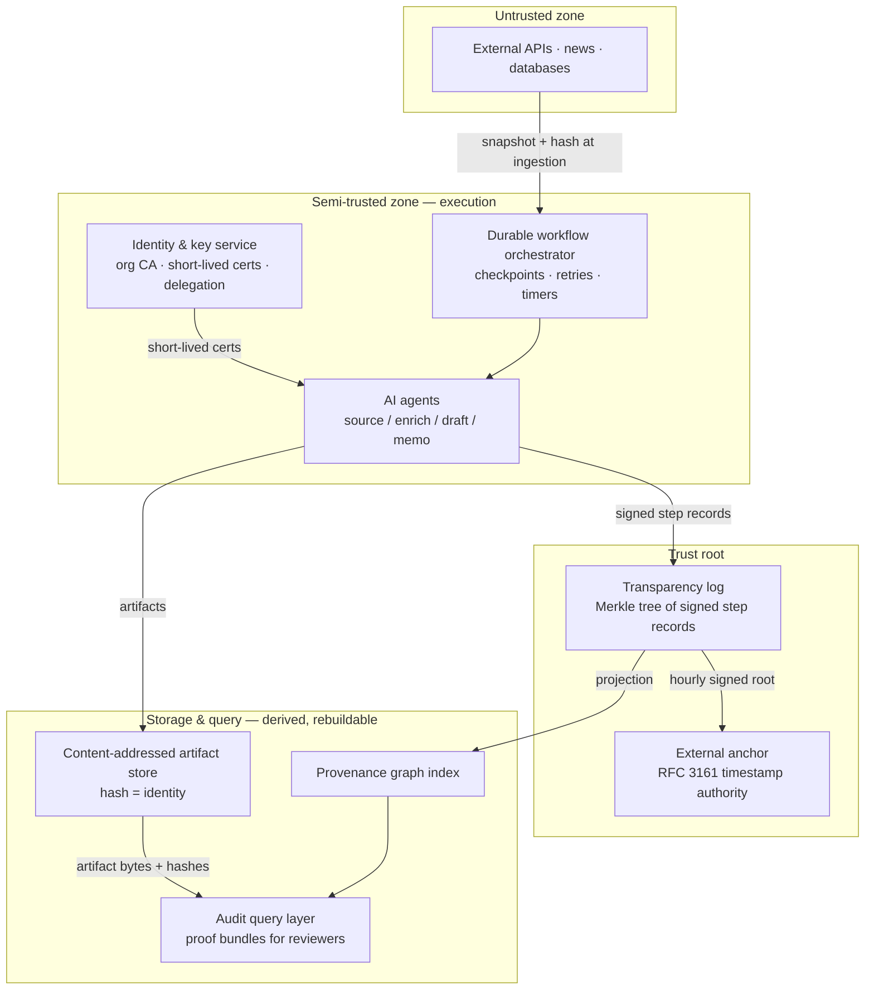

# Provenance & Auditability for an Agentic Investment Platform

**System design case study — submission draft v1**

---

## 1. Framing: the guarantee we can actually make

Soma's platform runs AI agents that source deals, enrich data, draft outreach, update the CRM, and write investment memos. These agents are non-deterministic: they hallucinate, they behave differently between runs, and they depend on external APIs we don't control. Meanwhile LPs, partners, and regulators need to know, for any artifact: *who produced it, from which inputs, and whether it has been modified.*

The design is built on one organizing decision:

> **We cannot make LLM steps deterministic, so we don't try. Instead, we make the *record* of every step deterministic, signed, and tamper-evident.** Every step — deterministic or not — is wrapped in a deterministic envelope: hash the inputs going in, hash the output coming out, sign the pair with the actor's identity, and append it to a log that nobody, including us, can rewrite.

This is the "determinism boundary" made concrete. The non-determinism stays contained inside the step; everything observable at the boundary is exact, attributable, and permanent. Provenance, audit, and traceability all become properties of the envelope stream, not of the AI.

**Threat model.** The system defends against: (a) silent modification of artifacts after creation, by anyone including administrators; (b) misattribution — an artifact claiming a different author, agent version, or input set than it truly had; (c) history rewriting — deleting or reordering the record after the fact; (d) impersonation of agents or humans. It explicitly does *not* defend against: false source data faithfully recorded, LLM outputs that are fluent but wrong, or an attacker with live control of a signing endpoint during its validity window. Section 4 treats these honestly as structural limitations rather than pretending architecture can remove them.

**Scale reality.** 5,000 agent actions/day today and 50,000/day in two years is **under one write per second**. Artifacts are 100 B–50 KB. This is not a throughput problem; it is a trust problem. That observation licenses deliberately boring storage choices (a single ordered log, one Postgres instance, object storage) and lets the complexity budget go where it matters: verifiability. Audit queries needing minutes, not milliseconds, similarly permit a simple query layer over precomputed indexes.

---

## 2. High-level architecture

### Components and trust zones



1. **Content-addressed artifact store (CAS).** Every artifact — memo, email draft, founder profile, enriched dataset, and every *input snapshot* — is stored under the SHA-256 of its bytes. The hash is the identity, so "has this been modified?" is definitionally answerable: a modified artifact is a different artifact with a different address. Plain object storage (S3); at 50 K × 50 KB/day ≈ 2.5 GB/day worst case, cost is a non-issue.

2. **Signed provenance records.** One per step *attempt* (schema in §3). This is the deterministic envelope: input hashes, output hash, actor identity and version, model/prompt/parameter digest for AI steps, timestamps, signature.

3. **Transparency log — the trust root.** Records are appended to a Merkle tree in strict sequence. The tree yields *inclusion proofs* ("this record is in the history") and *consistency proofs* ("today's history extends yesterday's; nothing was rewritten"). Hourly, the signed tree root is anchored externally (an RFC 3161 timestamping authority; optionally a public ledger later). After anchoring, not even a Soma administrator can rewrite the past without the math visibly breaking.

4. **Durable workflow orchestrator.** Temporal-style durable execution. Every workflow is a sequence of steps with checkpointed state; failures resume from the last checkpoint rather than restarting blind. Deterministic steps (DB writes, API calls) are made idempotent with idempotency keys so retries don't double-apply. Non-deterministic steps are never blindly re-executed on replay — their recorded outputs are reused. Each retry *attempt* emits its own provenance record; history shows what actually happened, including the failures. Long-running workflows (days) are just checkpointed state plus timers — no process needs to live that long.

5. **Identity & key service.** An organizational CA issues short-lived certificates (validity: hours) to agent *instances*. Each agent cert carries a delegation chain terminating at a human principal: `human → agent-role → agent-instance`. Humans authenticate through the existing SSO/IdP and sign with keys in hardware-backed storage. Rotation is automatic by expiry; revocation is mostly unnecessary because credentials barely outlive a workflow — for the rare emergency, the log of issued certs (itself in the transparency log) supports explicit denylisting. No long-lived agent secrets exist to steal.

6. **Audit query layer.** A graph projection built by consuming the log: nodes are artifacts and actors, edges are "derived-from" and "produced-by". The projection is *derived and rebuildable* — if it's ever corrupted or distrusted, replay the log and rebuild. Auditor answers ship with proof bundles (§3.4) verifiable outside our infrastructure.

### Data flow: one memo, end to end

1. A sourcing workflow ingests a news article. The raw response bytes are snapshotted into the CAS; a provenance record signs "fetched URL `u` at time `t`, got content `H(a)`".
2. An enrichment agent (LLM step) reads that snapshot plus a financials API snapshot, and produces a founder profile. Its record lists both input hashes, the output hash, the agent cert, model ID, prompt-template digest, and sampling parameters.
3. The memo agent consumes the profile and other artifacts; same envelope. A partner edits the memo: the edit is a *new* artifact whose record lists the prior memo as input and the partner's human identity as actor — edits never overwrite.
4. The CRM sync step writes downstream systems, recording the CRM object IDs touched. External systems hold *copies*; the CAS + log remain the system of record.
5. Every record lands in the transparency log within its batch interval (seconds). The graph index updates from the log tail. The memo now has a complete, signed, tamper-evident family tree.

### Storage layers

| Layer | Contents | Mutability | Recovery story |
|---|---|---|---|
| Transparency log | Signed provenance records, Merkle tree | Append-only | The source of truth; replicated + anchored |
| CAS (object store) | Artifact + snapshot bytes by hash | Immutable blobs | Any copy re-verifiable against hashes in the log |
| Graph index (Postgres) | Provenance DAG projection, query indexes | Derived | Rebuild by log replay |
| Orchestrator state | Workflow checkpoints, timers | Operational | Standard HA; provenance does not depend on it after the fact |

---

## 3. Deep dive: the provenance data structure

The prompt asks for one component in depth. The provenance record, the DAG it induces, and the transparency log that makes the whole structure tamper-evident are the heart of the system — everything else is scaffolding around them.

### 3.1 The provenance record

```json
{
  "record_version": 1,
  "step_id": "wf_8f2e/step_04/attempt_02",
  "workflow_id": "wf_8f2e",
  "action_type": "llm_generate | api_fetch | db_write | human_edit | human_approval",
  "actor": {
    "identity": "agent:memo-writer/v2.3.1",
    "cert_fingerprint": "sha256:9c1d…",
    "delegation_chain": ["human:jane@soma.vc", "role:memo-agents"]
  },
  "inputs": [
    {"artifact": "sha256:a11f…", "role": "founder_profile"},
    {"artifact": "sha256:03bc…", "role": "market_data_snapshot"}
  ],
  "output": {"artifact": "sha256:77e0…", "media_type": "text/markdown"},
  "nondeterminism": {
    "model": "provider/model-id@2026-05",
    "prompt_template": "sha256:5dd2…",
    "rendered_prompt": "sha256:c4a9…",
    "params": {"temperature": 0.7, "max_tokens": 4096},
    "provider_request_id": "req_abc123"
  },
  "timestamps": {"started": "…", "completed": "…"},
  "prev_attempt": "wf_8f2e/step_04/attempt_01",
  "signature": "ed25519:…"
}
```

Design decisions worth defending:

- **Hashes, never bytes, in the record.** Records stay ~1 KB regardless of artifact size; the log stays small and fast to prove against; large or sensitive content lives in the CAS. This split is also what makes the privacy story possible (§4, limitation 5).
- **The `nondeterminism` block is the determinism boundary, reified.** For an LLM step we cannot record *why* the output is what it is, but we record everything that parameterized the call — model version, prompt digests, sampling params, the provider's own request ID. The step becomes fully *attributable* even though it is not *replayable*.
- **Attempts are first-class.** `attempt_02` links to `attempt_01` rather than replacing it. Retries, failures, and regenerations are part of history — an auditor sees that the memo took three generations and a human rejection, which is precisely the kind of trace an LP asking hard questions deserves.
- **Human actions use the same schema.** An approval is a record whose `action_type` is `human_approval`, input = the artifact hash approved, actor = the human identity. Decision traceability falls out for free: "who approved this and what exact bytes did they approve" is one record.

### 3.2 The DAG: hash links are the provenance

Because every record references its inputs by content hash, and those inputs' creation records reference *their* inputs, the records collectively form a Merkle DAG. The edges aren't rows in some mutable join table that could drift or be edited — they're hash references inside signed records. To falsify an artifact's ancestry you'd have to forge a hash preimage (cryptographically infeasible) or re-sign new records — and re-signed records can't be inserted into the already-anchored log (§3.3). Lineage and integrity are therefore the *same* mechanism, not two systems that can disagree.

### 3.3 The transparency log: making the DAG rewrite-proof

The DAG proves internal consistency, but a DAG alone can't prove *completeness* — that records weren't quietly deleted, or a parallel forged history substituted. That's the transparency log's job (same construction as Certificate Transparency / Sigstore's Rekor):

- Every record is appended to a binary Merkle tree at the next sequence number; each gets a *signed inclusion promise* immediately, and the batched tree root updates within seconds.
- **Inclusion proof:** log₂(n) hashes demonstrating record *r* is under root *R*. At 18 M records (year 2), that's ~25 hashes — a proof fits in a QR code.
- **Consistency proof:** demonstrates root *R₂* extends root *R₁* append-only. Any external party holding yesterday's root can verify today's log still contains yesterday's history unchanged.
- **External anchoring:** hourly, the signed root goes to an RFC 3161 timestamping authority. An auditor who trusts only the TSA — not Soma — can verify that any record proven under an anchored root existed by that hour and was never subsequently rewritten. Insider tampering after anchoring is *mathematically evident*, not just policy-forbidden.

**Why not a blockchain?** A permissionless chain buys removal of the trusted operator at the cost of enormous operational machinery — for an internal platform writing <1 record/second with an external notary already bounding insider rewrites to a one-hour window, that trade is disproportionate. The design keeps the *option* (anchoring roots to a public chain is one integration), which is the correct amount of blockchain for this problem: an escape hatch, not a foundation.

### 3.4 The audit walk and the proof bundle

The LP asks: *"Show me every action and data source that contributed to the decision to invest in Company X."*

1. Resolve the decision artifact (the approved memo / IC decision record) in the graph index.
2. Reverse-BFS along `derived-from` edges to the frontier of external snapshots and human inputs. Depth in practice is 5–15; subgraph size tens to hundreds of nodes — milliseconds in Postgres with recursive CTEs; the "minutes" budget is spent assembling proofs, not traversing.
3. Emit the **proof bundle**: every record in the subgraph + inclusion proofs against an anchored root + the consistency chain to the present + the cert chains for every signature + the TSA anchor receipts. Optionally the artifact bytes themselves (or redacted subsets — hashes still verify whatever is disclosed).
4. A standalone open-source verifier — a few hundred lines, no dependence on Soma infrastructure — checks signatures, hash links, inclusion proofs, and anchors. The LP's auditor verifies the history *without trusting us*, which is the entire point.

---

## 4. Tradeoffs: genuine limitations, admitted

These are not stylistic preferences. Each is a structural hurdle we know will occur and cannot remove without rewriting the system or solving an open research problem. We state what we chose and why the limitation is acceptable — that honesty is itself a design feature, because auditors distrust systems that claim too much.

**1 — Provenance proves lineage, not truth.** We prove a memo derives from a specific article snapshot; we cannot prove the article was accurate or the LLM summarized it faithfully. A hallucination gets recorded with perfect integrity. *Why unfixable:* LLM factuality is unsolved; no infrastructure change solves it. *Choice:* draw the guarantee boundary honestly (integrity, not veracity) and require `human_approval` records on decision-grade artifacts so accountable human judgment is in every chain that matters.

**2 — Non-deterministic steps are attributable, never verifiable-by-replay.** For deterministic steps an auditor can re-execute and compare. Re-running an LLM yields different output, and providers don't sign inference results — so no one can *prove* the recorded output is what the model returned, only that we committed to it at time *t* under those parameters. *Why unfixable today:* verifiable inference (provider attestation, zkML) is research-stage. *Choice:* the `nondeterminism` block captures the full call context and the provider's request ID (supporting provider-side dispute resolution), and we upgrade to provider attestation the day it exists.

**3 — A compromised endpoint signs lies with a valid key.** Signatures prove which identity produced a record, not that the machine holding the key was uncompromised at signing time. *Why unfixable:* endpoint compromise is beyond cryptography's reach — the classic limit of authentication. *Choice:* short-lived certs shrink the exposure to hours; the anchored log bounds *when* forgeries could have entered; anomalous-signing detection narrows it further. Containment, not elimination.

**4 — External data is trust-on-first-fetch.** Snapshot-and-hash proves what *we received*, not what the provider truly served (almost no API signs responses; TLS authenticates the channel, not the archived content). *Why unfixable:* we cannot change third parties' infrastructure. *Choice:* hash at the earliest possible boundary with full fetch metadata, so any dispute reduces to "here is exactly what their API returned at 14:02 UTC on March 3" — which is as far as any system can go.

**5 — Append-only forever collides with the right to be forgotten.** An unerasable log is the point; GDPR-style deletion demands are also legitimate. Both cannot fully win. *Why unfixable later:* immutability versus deletion is a true either/or — retrofitting deletion into the log destroys the trust story. *Choice (made up front because it cannot be retrofitted):* personal data never enters the log — only hashes do. Sensitive artifacts are encrypted in the CAS with per-subject keys; deleting the key ("crypto-shredding") renders content unrecoverable while every proof over the remaining history still verifies. The record of *actions* survives; the personal *content* is destructible by design.

**6 — Tamper-evident, not tamper-proof, with a bounded window.** Until the hourly anchor lands, an insider controlling the log service could theoretically rewrite the unanchored tail. *Why not fixed:* closing the window entirely requires distributed consensus among independent parties — disproportionate machinery for an internal platform at <1 write/second. *Choice:* accept and disclose a bounded one-hour insider-rewrite window; shrink it by anchoring more frequently (or to multiple independent notaries) if audit requirements tighten. This is a dial, not a wall.

### What we optimized for, and the evolution path

**Optimized for:** external verifiability without trusting the operator; audit-in-minutes with proofs; a small trusted computing base (log + CA, not every service); operational boringness at known scale.

**Deliberately not optimized for:** write throughput (unneeded by ~4 orders of magnitude); storage minimalism (full input snapshots beat disk savings — reproducibility of *context* is what makes year-later audits possible); zero-knowledge privacy toward auditors (proof bundles reveal graph structure; selective-disclosure redaction is the designed v2, enabled by the hashes-not-bytes split).

**At 10×–100× scale:** shard the log per fund or workflow class with a super-root binding shards; batch anchoring; tier cold CAS content to archival storage (hashes stay hot); move the graph projection to a dedicated graph store if traversal breadth ever demands it. Nothing in the trust core — record schema, DAG, log construction, proofs — changes shape; scale evolves the plumbing around an unchanged guarantee.

---

*Prepared for the Soma Capital engineering case study. The follow-up conversation can go deeper on any component; the deep dive (§3) is where the sharpest questions are expected and welcomed.*
